# Assignment 3 - PyTorch Training Pipeline
## Report


---

## Setup and How to Run

### Requirements

Install the required packages:

```bash
pip install torch torchvision torchaudio
pip install timm
pip install tensorboard
pip install wandb  
pip install pyyaml
pip install numpy
```

### Running the Pipeline

**Basic training:**
```bash
cd pipeline
python main.py --config config.yaml
```

**With command line overrides:**
```bash
python main.py --config config.yaml --dataset cifar100 --model_name resnet50 --batch_size 256
```

**Hyperparameter sweep :**
```bash
# Custom sweep (using config file)
python sweep.py --mode custom --config sweep_configs.yaml

```
**Metrics :**
```bash
# TensorBoard
# In another terminal
tensorboard --logdir=./runs
# Open http://localhost:6006

# Wandb
python main.py --config config.yaml --use_wandb

```

---
## No Pretraining vs Pretraining

### No Pretraining

| Configuration | Test Accuracy | Best Train Accuracy | Best Validation Accuracy | Training Time |
|----|------------|---------------------|--------------------------|---------------|
| 1  | 55.4%      | 47.98%              | 41.54%                   | 329.9 min     |
| 2  | 54.91%     | 97.74%              | 54.02%                   | 366.7 min     |

**Achieved 55.4% accuracy on CIFAR-100 without pretraining.**

#### Configuration 1:

- It was trained for 50 epochs with a batch size of 128, using ResNet18 without pretraining. 
- The optimization was performed using SGD with momentum 0.9, a learning rate of 0.1, and a weight decay of 5e-4. 
- A StepLR scheduler with a step size of 30 and gamma 0.1 controlled the learning rate decay. 
- The model used label smoothing (0.1).
- Data augmentation included RandomCrop, RandomHorizontalFlip, ColorJitter, Cutout, and AutoAugment.
- A batch size scheduler doubled the batch size halfway through training. 

#### Accuracy Curve
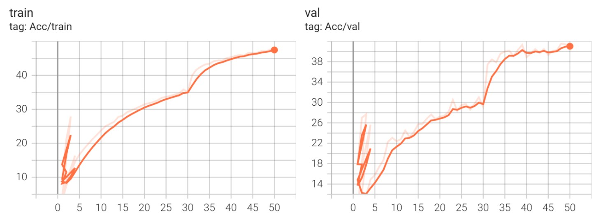

#### Loss Curve
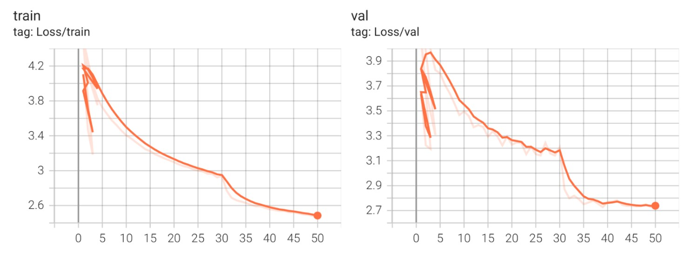

#### Learning Rate
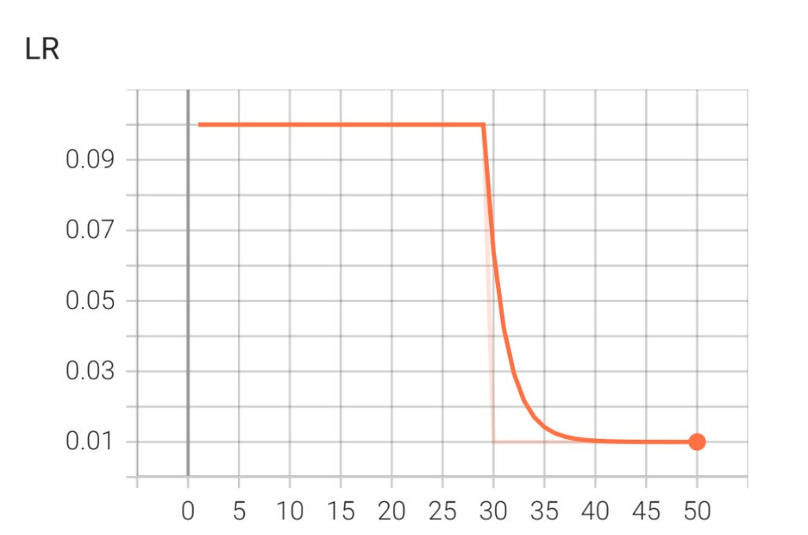


#### Time Evolution
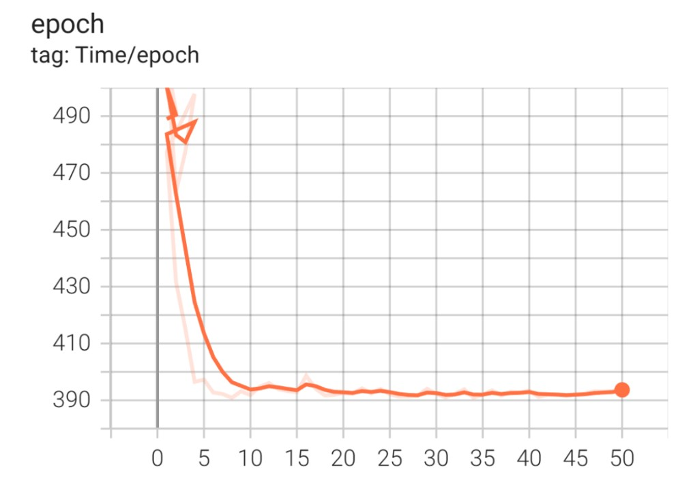

#### Configuration 2:

- It was trained for 50 epochs but replaced with the Adam optimizer using a learning rate of 0.01. 
- The batch size was reduced to 64, and a linear batch size scheduler gradually increased it throughout training.

#### Accuracy Curve
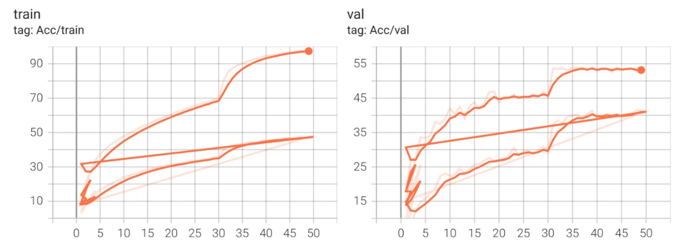

#### Loss Curve
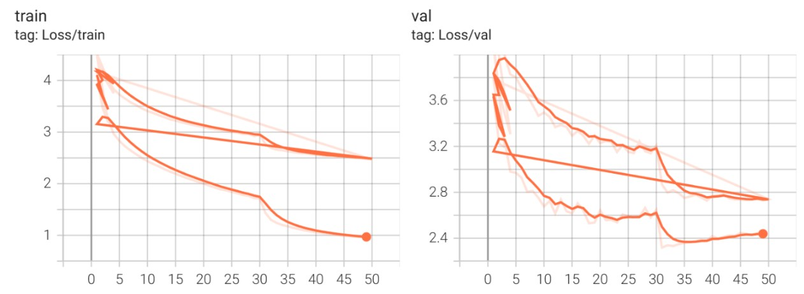

#### Learning Rate
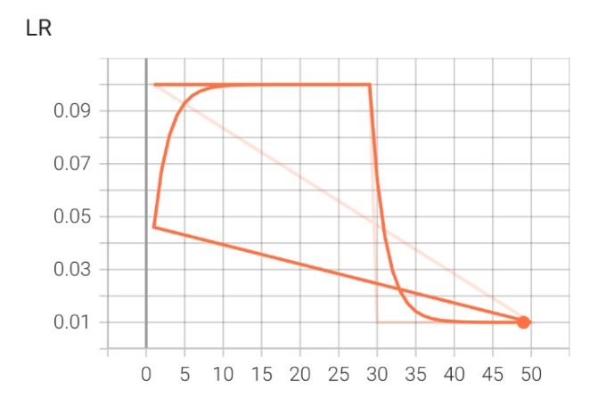

#### Time Evolution
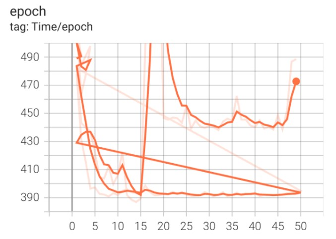

### With Pretraining

| Configuration | Test Accuracy | Best Train Accuracy | Best Validation Accuracy | Training Time |
|----|---------------|---------------------|--------------------------|---------------|
| 1  | 63.35%        | 89.78%              | 62.62%                   | 278.4 min     |

 The pretrained configuration reused the first setup but initialized ResNet18 with pretrained weights.

#### Accuracy Curve
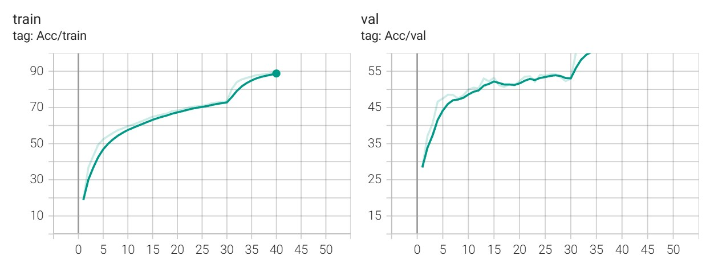

#### Loss Curve
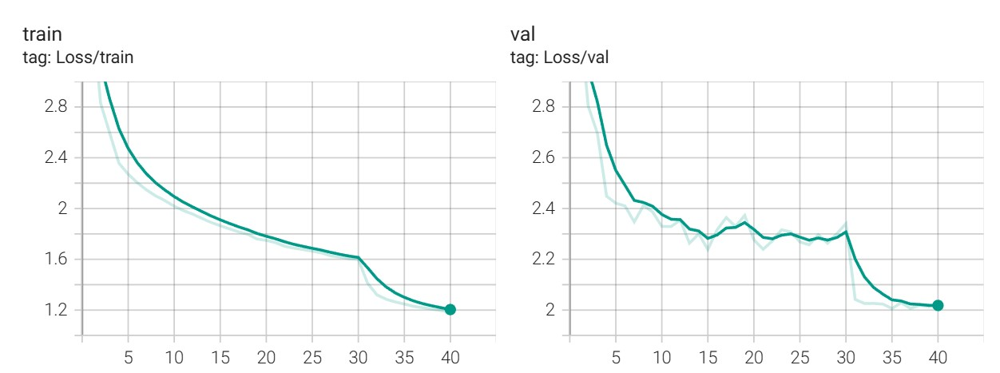

#### Learning Rate
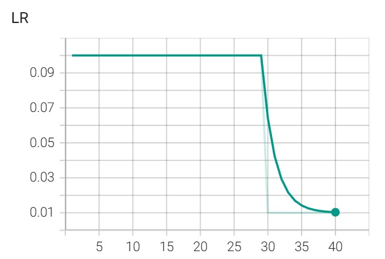

#### Time Evolution
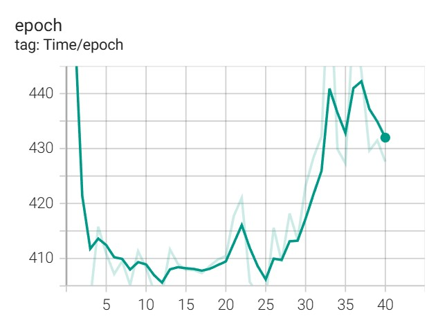

The pretrained model boosted performance to 63.35%, and it also converged faster, reducing training time by more than 50 minutes.

---

## Hyperparameter Sweep

A custom sweep mechanism was implemented using a Python script and TensorBoard. 
Eight predefined configurations were evaluated:


| Config | Model       | Optimizer | LR     | Best Train Accuracy | Best Validation Accuracy | Test Accuracy | Time (min) |
|--------|-------------|-----------|--------|---------------------|--------------------------|---------------|------------|
| 1      | resnet50    | SGD       | 0.1    | 69.18%              | 52.99%                   | 58.73%        | 470.4      |
| 2      | resnet18    | AdamW     | 0.001  | 74.05%              | 46.13%                   | 52.62%        | 234.9      |
| 3      | resnest14d  | SAM       | 0.05   | 53.19%              | 48.75%                   | 62.45%        | 405.5      |
| 4      | resnet18    | SGD       | 0.1    | 47.98%              | 41.54%                   | 55.4%         | 329.9      |
| 5      | resnet18    | Adam      | 0.01   | 97.74%              | 54.02                    | 54.91%        | 366.7      |
| 6      | mlp         | Adam      | 0.001  | 32.44%              | 32.48%                   | 44.74%        | 395.3      |
| 7      | resnest26d  | Muon      | 0.001  | 63.21%              | 47.11%                   | 52.85%        | 440.2      |
| 8      | resnest14d  | SGD       | 0.1    | 71.88%              | 49.30%                   | 56.12%        | 388.6      |


#### Configuration 1:
- Trained for 40 epochs with a batch size of 64, using a batch size scheduler that doubles the batch size halfway through training. 
- The learning rate was controlled by a StepLR scheduler.

#### Accuracy Curve
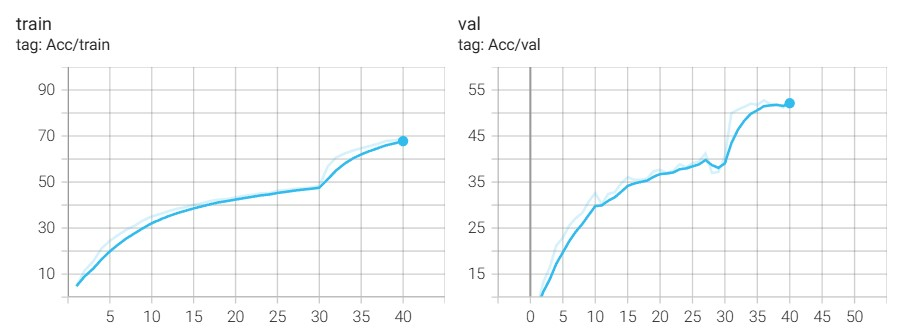

#### Loss Curve
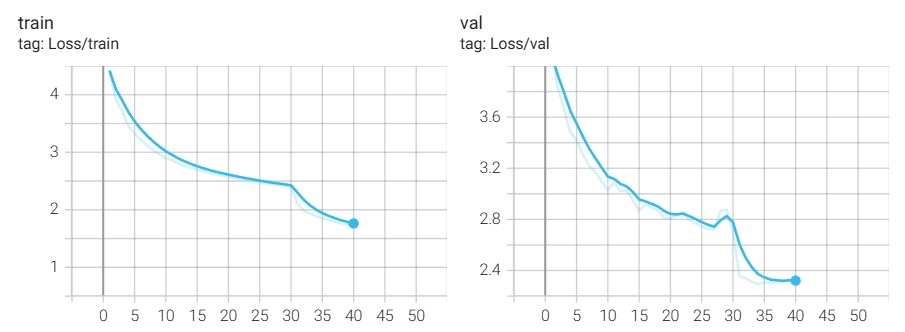

#### Learning Rate & Time Evolution
<p float="left">
  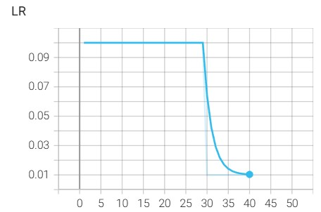
  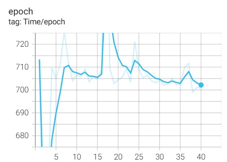
</p>

#### Configuration 2:
- Trained for 50 epochs with a batch size of 128, again with a double_at_half batch size scheduler. 
- The learning rate was adapted using ReduceLROnPlateau.


#### Accuracy Curve
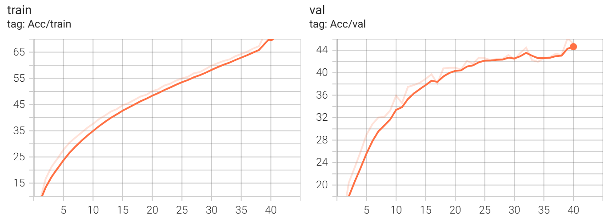

#### Loss Curve
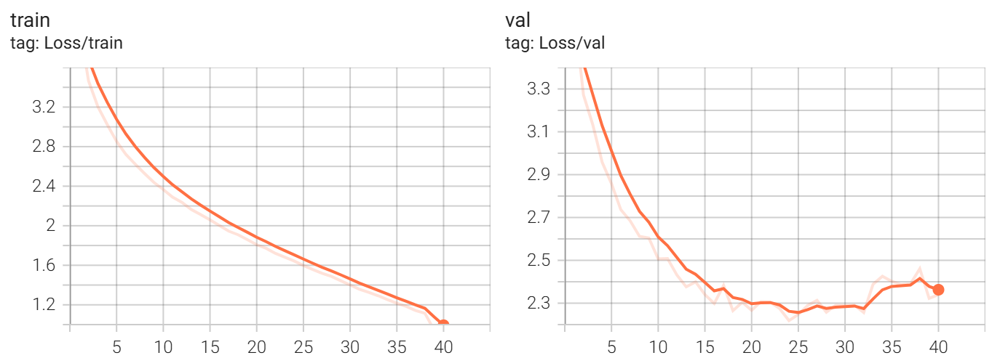

#### Learning Rate & Time Evolution
<p float="left">
  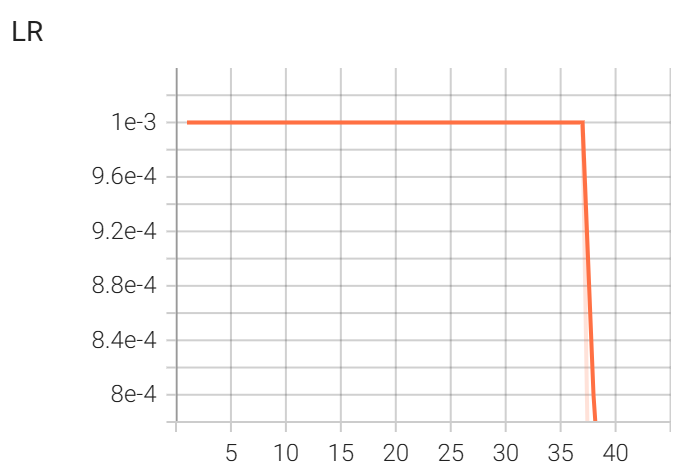
  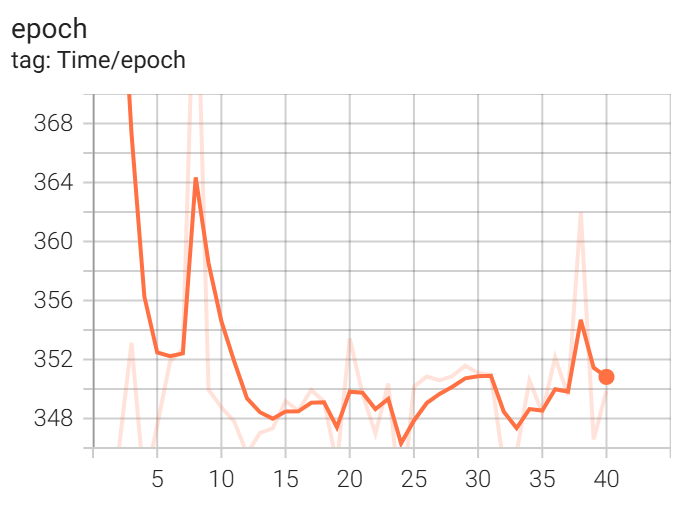
</p>

#### Configuration 3:
- Trained for 40 epochs with a batch size of 128, and the batch size was doubled halfway through training. 
- The learning rate followed a StepLR scheduler.

#### Accuracy Curve
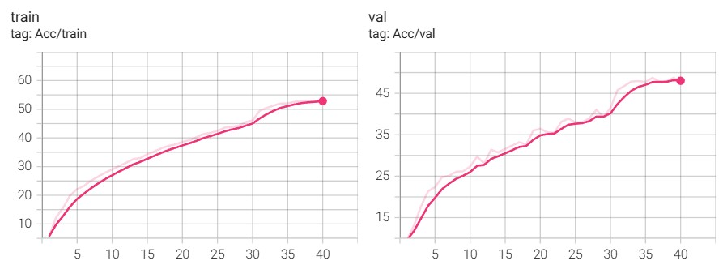

#### Loss Curve
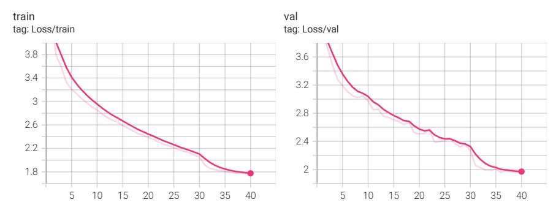

#### Learning Rate & Time Evolution
<p float="left">
  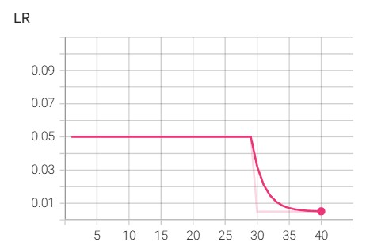
  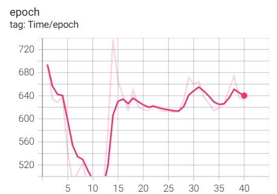
</p>

#### Configuration 6:

- Trained for 50 epochs with a batch size of 128, with no batch size scheduler (batch size stayed constant). 
- The learning rate was annealed using StepLR.

#### Configuration 7:

- Trained for 40 epochs with a batch size of 128, again without a batch size scheduler. 
- The learning rate followed a StepLR scheduler

#### Accuracy Curve
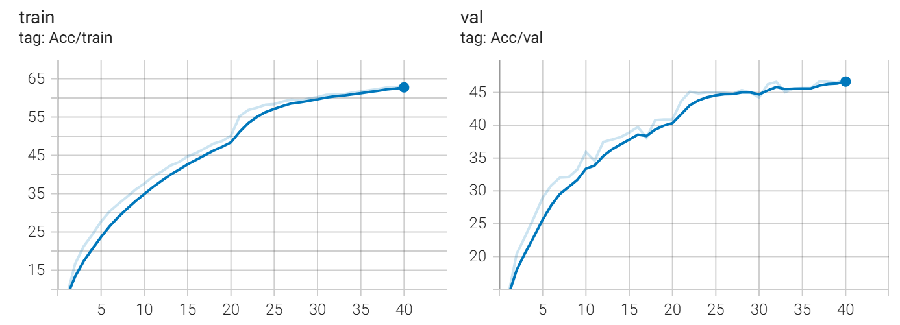

#### Loss Curve
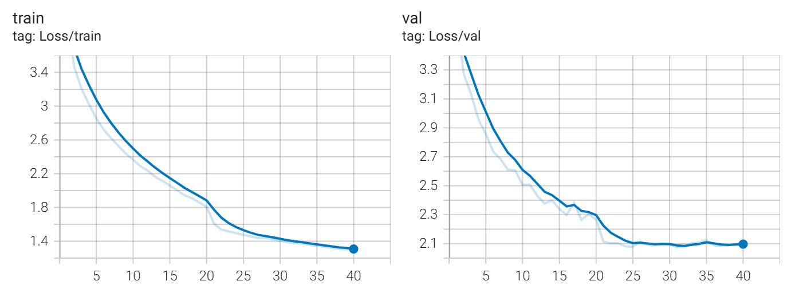

#### Learning Rate & Time Evolution
<p float="left">
  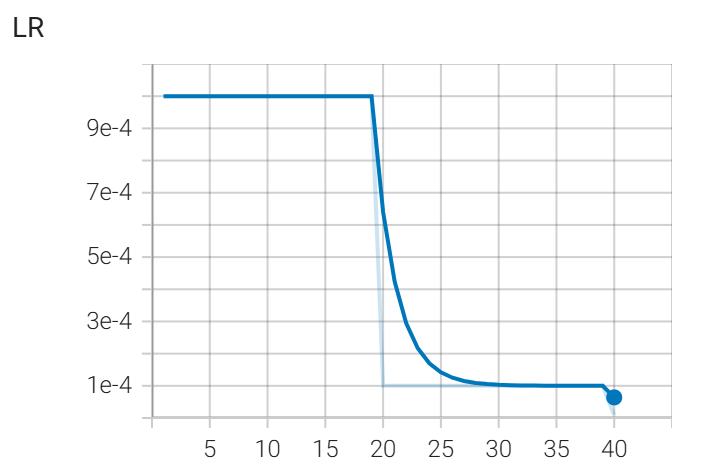
  
</p>

#### Configuration 8:

- Trained for 40 epochs with a batch size of 128, using a linear_increase batch size scheduler. 
- The learning rate was managed via ReduceLROnPlateau.

The best-performing configuration was ResNeSt14d trained with the SAM optimizer (Config 3), which achieved the highest test accuracy at 62.45%.

---

## Efficiency 

All experiments were executed entirely on CPU, which naturally resulted in significantly longer training times compared to GPU-based setups.

| Config | Model       | Optimizer |  Test Accuracy | Time (min) |
|--------|-------------|-----------|----------------|--------------------|
| 1      | resnet50    | SGD       |  58.73%        | 470.4      |
| 2      | resnet18    | AdamW     |  52.62%        | 234.9      |
The training times varied significantly between configurations (ranging from ~234 minutes to ~470 minutes).
Despite this hardware limitation, the pipeline remained stable and memory-efficient due to 
mixed-precision training (AMP), compiled models, and adaptive batch size scheduling.

---


## Estimated Score

- Criteria 1: I expect to receive around 8 points, because my pipeline is device-agnostic, supports all required datasets, uses multiple models from timm, includes data augmentation, 
supports all required optimizers and LR schedulers, integrates a batch size scheduler, TensorBoard logging, and early stopping.
- Criteria 2: I expect 5–6 points, because I implemented a custom sweep with TensorBoard, included 8 configurations, described the parameters, and added metrics plots, but none of 
the models reached 70% accuracy on CIFAR-100.
- Criteria 3: I expect 1 point, because I explained efficiency limitations, reported timing measurements, and discussed why CPU slowed training.
- Criteria 4: I expect 1-2 points, because none of the configurations reached the target accuracies, but I included a separte
section in the report where I compared the results for no pretraining and pretraining.


